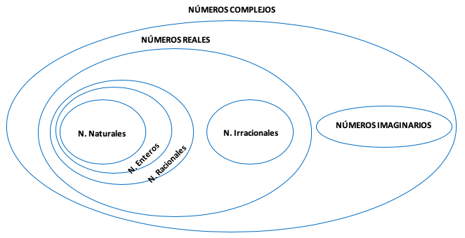
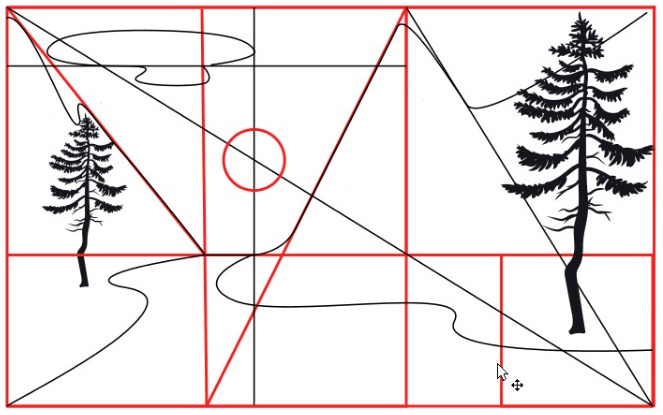

# Fractales sobre el conjunto de los números complejos y cuaterniones

## Números complejos.


## Operaciones con números complejos

```{r complex, echo=FALSE, out.width='100%', out.height='100%', fig.align="center", fig.cap="Esquema de los números complejos"}
if (knitr::is_html_output()) {
knitr::include_url("https://www.geogebra.org/classic/wdkjjtjp", height="700")} else {

}
```

## Funciones en el plano complejo y fractales ($f(z), z\in\mathbb{C}$ cualesquiera)

## Los conjuntos de Mandelbrot ($f(z)=z^2+c$)

## Los conjuntos de Julia ($f(z)=z^2+c$)

## Los cuaterniones y conjuntos de Mandelbrot y Julia 3D (Fractales orgánicos)

## Reconocimiento de fractales sobre formas orgánicas

## Sustentación de trabajos (\emph{Construcción de un fractal orgánico})

El número de oro \index{número de oro} es un número presente en la naturaleza, todo lo creado esta asociado con este número. La manera de recurrencia de las partes de los objetos visualmente atractivos están dispuestas de acuerdo a la razón y proporción del número áureo.

```{definition, aureo, name="Numero áureo"}
Es un numero
```

establecido por $\frac{1+\sqrt{5}}{2}=1.618$ denotado por $\phi$ o $\Phi$ es decir $$\phi=\frac{1+\sqrt{5}}{2}=1.618$$

Además la inversa de este numero es $$\phi^{-1}=\frac{1}{\phi}=\frac{\sqrt{5}-1}{2}=0.618$$

## Sección áurea

Es el proceso de generar el numero mediante el uso de una linea y la división que se realiza sobre este. Es decir dado un segmento $AB$, un punto $C$ uubicada entre los extremos $A$ y $B$ es la correspondiente (coloquialmente suele aproximarse con la tercera parte parte de este segmento). Exactamente se obtiene de la siguente manera. La razón de la *longitud de todo el segmento* y la *longitud del segmento mayor* es **proporcional** a la razón de la *longitud del segmento mayor* sobre la *longitud del segmento menor es decir*

$$
\frac{x+y}{x}=\frac{x}{y} (\#eq:aureo)
$$

simplificando $$
xy+y^2=x^2 (\#eq:new)
$$ es posible hallar el valor de uno de ellos fijando la otra, sea por ejemplo $y=2$ entonces la ecuación \@ref(eq:new) se reduce a $$
2x+4=x^2\Longleftrightarrow x^2-2x-4=0
$$

cuyas soluciones son $x_1=2\frac{1+\sqrt{5}}{2}$ y $x_2=2\frac{1-\sqrt{5}}{2}$

en general si $y=r$ entonces a ecuación \@ref(eq:new) se reduce a $$
rx+r^2=x^2\Longleftrightarrow x^2-rx-r^2=0
$$

cuyas soluciones son $x_1=r\frac{1+\sqrt{5}}{2}=r\phi$ y $x_2=r\frac{1-\sqrt{5}}{2}=r\left(-\frac{-1+\sqrt{5}}{2}\right)=r\left(-\frac{1}{\phi}\right)$

```{remark}
La proporción (\ref(eq:aureo) es igual a una constante de prorpocionalidad que es igual a $\phi$ es decir $\frac{x+y}{x}=\frac{x}{y}=\phi$
```

```{r C2, echo=FALSE, fig.cap="Circunferencia", fig.align="center"}

```

## Rectángulo áureo

## Pentágono y el número de oro

## Dodecaedro y el número de oro

## Aplicaciones del número de oro
### Terminologías
Algunos de estos son:
##### El número de oro
$$\phi=1.618$$
##### La sección áurea
Es un punto, recta o plano que secciona una cantidad (Todo) de modo las partes que generan gurdan relación con el número de oro.

***"La razon del todo sobre la parte mayor es igual a la razon de la parte mayor sobre la parte menor"***

Genera una ecuacion de segundo grado cuyas raices son $\phi$ y $\frac{1}{\phi}$

##### La proporción áurea
Es la igualdad de dos razones $$\frac{a}{b}=\frac{c}{d}=\phi=1.618$$
##### La sucesión áurea

1, $\phi$, $\phi^2$, $\phi^3$. $\ldots$

##### La sucesion de Fibonacci

2, 3, 5, 8, 13, 21, 34, 55, 89, 144, 233, 377, 610, 987, 1597, 2584, 4181, 6765, 10946, 17711, 28657, 46368, 75025, 121393, 196418, 317811, ...


si $a_n$ es n termino geenral de la sucecion de Fibonnacci entonces
$$ \lim_{n \to \infty} \frac{a_n}{a_{n-1}}=\phi  $$

### Ejemplo aplicativo

<!--
|  |
|:--:|
| *Componiendo sobre la estructura del rectángulo áureo* |

|  |
|:--:|
| *Sin la estructura del rectángulo áureo* |
-->
