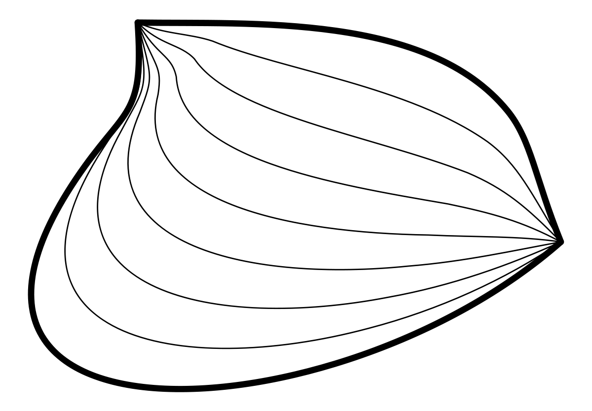
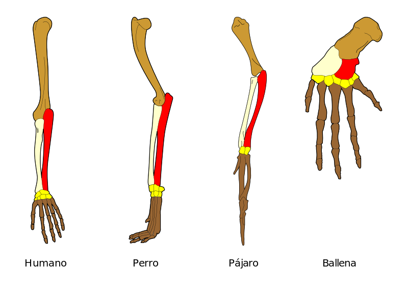
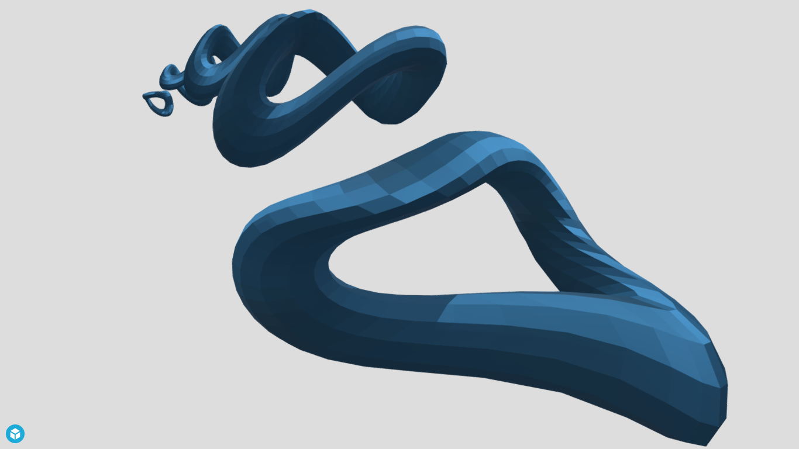
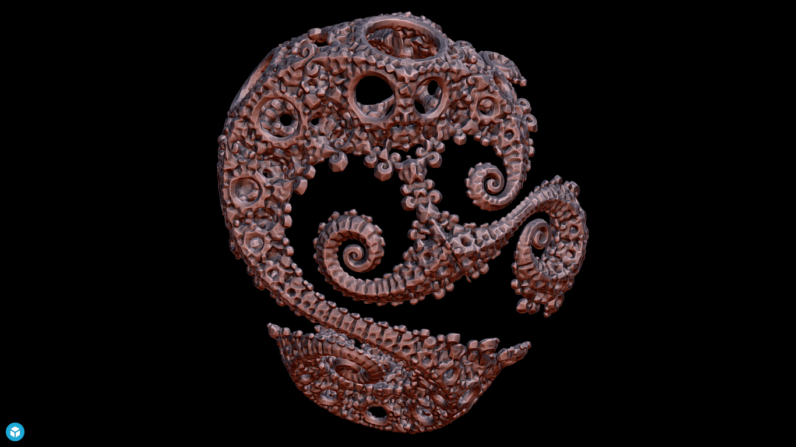
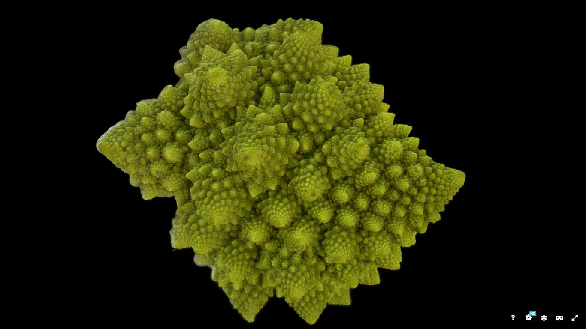
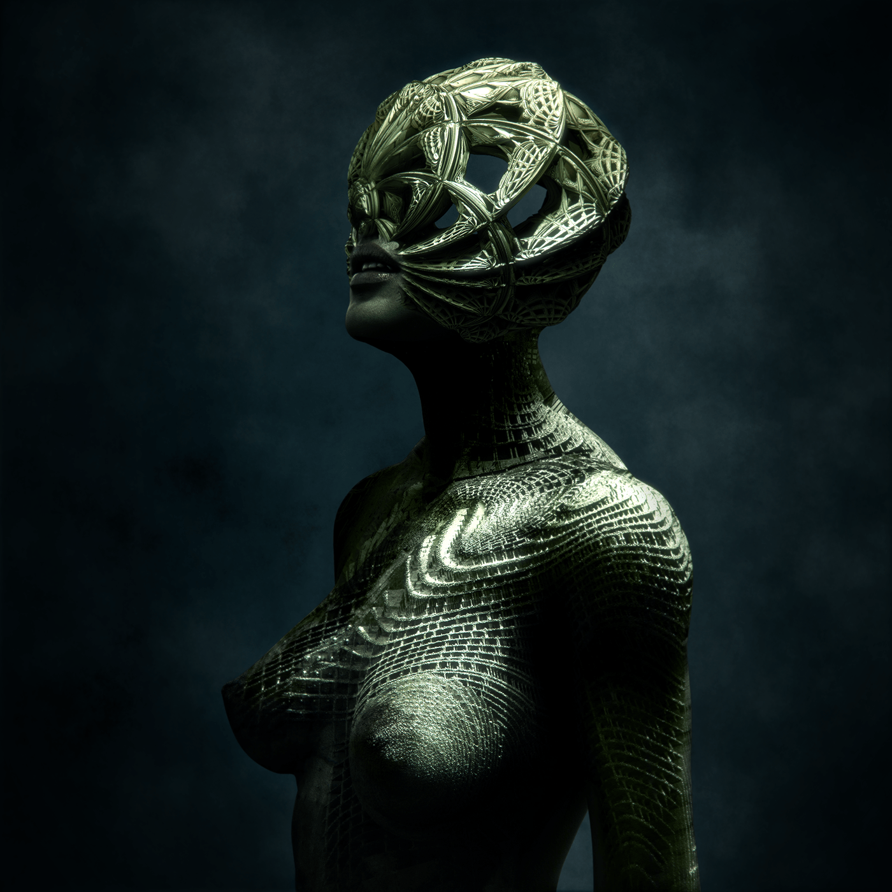
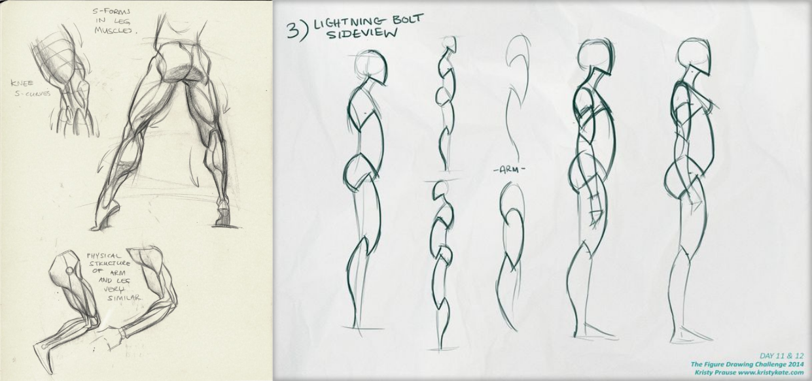
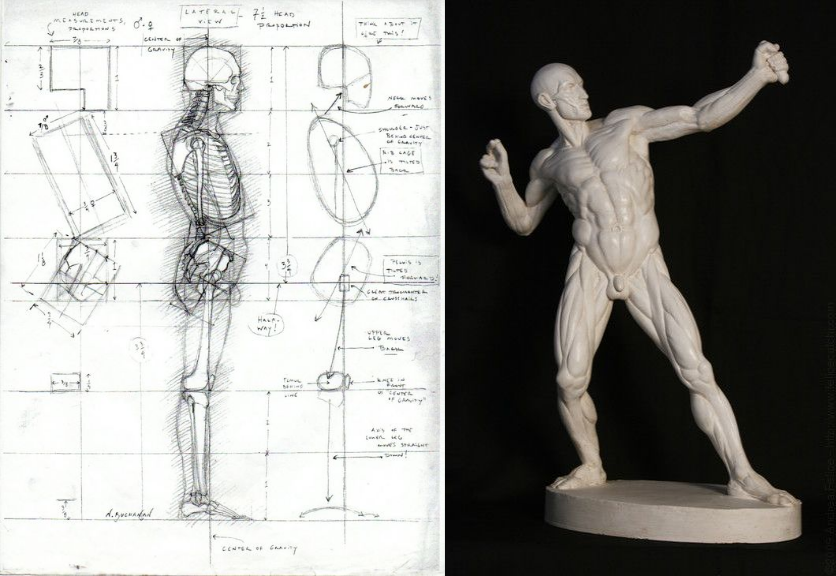
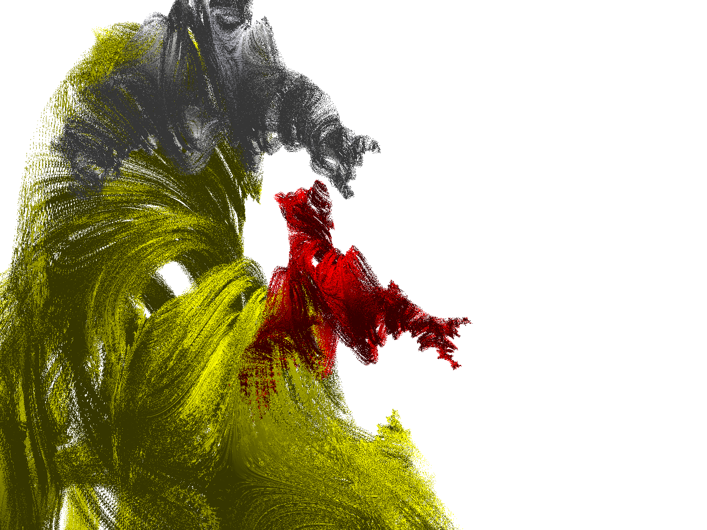

# Aplicaciones de los fractales en composiciones complejas

En este capítulo se estudiará que los __objetos artísticos__ siempre se componen de una __estructura fractal__. Estos aspectos son poco considerados al aplicar los fractales en composiciones complejas. Que se realizan de manera implícita e intuitiva en campos  abstracto-figurativas.

## Secuencias orgánicas bajo transformaciones topológicas

Se sabe que en la construcción de fractales existen dos tipos de transformaciones, _las elementales y las topológicas_. En esta sección trataremos sobre las _transformaciones topológicas_ con el objetivo de _modificar las formas de los términos_ de una secuencia de manera que cada termino que se suceda, mantenga en lo posible las _formas de los términos adyacentes_. En relación con el estudio comparativo de los seres vivos se tiene la siguiente definición, lo cual tiene mucha relación con los objetivos de esta sección y los subsiguientes @homology.

::: {.definition #homologia name="Homología"}
La **homología** es la _relación_ que existe entre _dos partes orgánicas diferentes_ de _dos organismos distintos_ cuando sus determinantes genéticos tienen el mismo origen evolutivo.
:::

::: {.definition #homotopia name="Homotopía"}
En topología, y más precisamente en topología algebraica, dos aplicaciones continuas de un espacio topológico en otro se dicen homótopas (del griego homos = mismo y topos = lugar) si una de ellas puede "deformarse continuamente" en la otra.
:::

```{r homotopia, echo=FALSE, out.width='50%', fig.pos = "!ht", fig.align="center", fig.cap="Los dos caminos en líneas punteadas que se muestran arriba son homótopos en relación a sus extremos. La animación muestra una posible homotopía entre ellos"}

```

Como @homology comenta:

> Existe homología entre órganos dados de dos especies diferentes, cuando ambos derivan del órgano correspondiente de su antepasado común, con independencia de cuán dispares puedan haber llegado a ser. Las cuatro extremidades pares de los vertebrados con mandíbula (gnatóstomos), desde los tiburones hasta las aves o los mamíferos, son homólogas. De la misma manera, el extremo de la pata de un caballo es homólogo al dedo mediano de la mano y el pie humano.

::: {.remark #homologiaremark name="Relación entre la homología y la sucesión bajo transformaciones topológicas"}

Se observa que la *homología* \index{homología} es una *sucesión* de formas que mantiene *similaridad* entre sus términos o elementos, es importante que la diferencia entre un termino y otro esta afectada por una ligera __transformación topológica__\index{transformación topológica}.

<!--
\@ref(rmk:homologiaremark)
-->
:::

En la observación anterior hace referencia de que todo los objetos de tipo secuencial, mantiene la homología.

```{r homologia, echo=FALSE, out.width='100%', fig.pos = "!ht", fig.align="center", fig.cap="Homología de varios huesos (mostrados en distintos colores) de las extremidades delanteras de cuatro vertebrados"}

```


```{r Suscecion, echo=FALSE, out.width='100%', fig.pos = "!ht", fig.align="center", fig.cap="Sucesión orgánica bajo transformaciones topológicas"}
if (knitr::is_html_output()) {
knitr::include_url("https://sketchfab.com/models/703d3d2905534635b60e0fd649f6d912/embed")
} else {

}
```


## Fractales orgánicos bajo transformaciones topológicas (Sketchfab organic)

Se sabe que un fractal es una colección de sucesiones cuyos términos se constituyen de secuencias de formas homólogas. Es decir _una secesión de sucesiones_ por tanto esas formas que componen son copias transformadas topológicamente.


```{r Sketch, echo=FALSE, out.width='100%', fig.pos = "!ht", fig.align="center", fig.cap="Fractales orgánicos bajo transformaciones topológicas - Sketchfab organic"}
if (knitr::is_html_output()) {
knitr::include_url("https://sketchfab.com/models/d8b34c3d654d46729aaedca61b367957/embed")
} else {

}
```

En l Figura \@ref(fig:Sketch) se tiene la forma espiralada se sucede de acuerdo a la transformación topológica  en cada uno de los términos.


```{r Sketch2, echo=FALSE, out.width='100%', fig.pos = "!ht", fig.align="center", fig.cap="Fractales orgánicos bajo transformaciones topológicas - Sketchfab organic"}
if (knitr::is_html_output()) {
knitr::include_url("https://sketchfab.com/models/a4bbfae822f04b648f67e908396bc9f2/embed")
} else {

}
```


## La figura humana como un fractal (fractal body modelado)

La figura humana se estructura en base a una suceción de estructuras fractales desde los niveleres moleculares, celulares, orgánicos, sistemáticos y corporales. Pues debido a ese orden se sucede la existencia humana. En este caso el arte se encarga de estudiar esos patrones a nivel corporal o físico de la figura humana. De acuerdo a las figura \@ref(fig:body) y los subsiguientes se pone de manifiesto estructuras fractales, es decir secuencia de secuencias.


[Body fractal](https://www.behance.net/gallery/11339339/FRACTAL-BODY)

```{r body1, echo=FALSE, out.width='70%', fig.pos = "!ht", fig.align="center", fig.cap="Construccion de la figura humana manifestando fractal"}

```


```{r body, echo=FALSE, out.width='100%', fig.pos = "!ht", fig.align="center", fig.cap="Los ejes de la figura humana se suceden de acuerdo a la secuencia de segmentos de curvas y curvaturas de estas"}

```
```{r body2, echo=FALSE, out.width='100%', fig.pos = "!ht", fig.align="center", fig.cap="La estructura de la figura se sucede de acuerdo a una secuencia, además las protuberencias de los músculos son una coleccion de secuencias (fractal)"}

```


## Fractal en el canon


## Software's generadores de Fractales 2D y 3D

###  POV-Ray (3D)


La persistencia de Vision Raytracer es una herramienta de software libre de alta calidad para crear impresionantes gráficos tridimensionales . El código fuente está disponible para aquellos que quieran hacer sus propios puertos.

```{r ray, echo=FALSE, out.width='100%', fig.pos = "!ht", fig.align="center", fig.cap="Homología de varios huesos (mostrados en distintos colores) de las extremidades delanteras de cuatro vertebrados"}

```

````{verbatim}
#version 3.6;
global_settings{ assumed_gamma 1.3 max_trace_level 50}
#include "colors.inc"
#include "functions.inc"
#include "logo.inc"

background { color White }
camera{ location  <1,-2,-1>  
        angle 0 // direction 2*z
        right    x*image_width/image_height
        // keep propotions with any aspect ratio
        look_at   <1,-.4,0>
      }
light_source {<-140,200, 300>
   rgb <1.0, 1.0, 0.95>*1.5 }
light_source {<-140,200, -300>
   rgb <1.0, 1.0, 0.95>*1.5 shadowless}
light_source {< 140,200,-300>
   rgb <0.9, 0.9, 1.00>*1.9 }

julia_fractal{ <-0.023,0.8,-0.83,-0.095>
   quaternion // quaternion hypercomplex
   cube             // Types: sqr  cube
   max_iteration 20
   precision 200     // 10...500

   texture{
  //   pigment{ color rgb<0.85,0.1,0.1>}
    // finish { phong 1}
     pigment {White*0.8}
     //finish {phong 0.7 reflection 0.1}
     //normal {bumps 0.05 scale 1}

   } // end of texture
   scale<.5,.5,.5>
   rotate<0,0,0>
   translate<0.5,0,-0.5>
} // end of julia_fractal ----------

    julia_fractal{ <-0.023,0.8,-0.83,-0.095>
   quaternion // quaternion hypercomplex
   cube             // Types: sqr  cube
   max_iteration 20
   precision 200     // 10...500

   texture{
  //   pigment{ color rgb<0.85,0.1,0.1>}
    // finish { phong 1}
     pigment {Red*0.8}
     //finish {phong 0.7 reflection 0.1}
     //normal {bumps 0.05 scale 1}

   } // end of texture
   scale<0.5,.5,.5>
   rotate<0,20,0>
   translate<0.9,0,0.5>
} // end of julia_fractal ----------

    julia_fractal{ <-0.023,0.8,-0.83,-0.095>
   quaternion // quaternion hypercomplex
   cube             // Types: sqr  cube
   max_iteration 20
   precision 200     // 10...500

   texture{
  //   pigment{ color rgb<0.85,0.1,0.1>}
    // finish { phong 1}
     pigment {Yellow*0.8}
     //finish {phong 0.7 reflection 0.1}
     //normal {bumps 0.05 scale 1}

   } // end of texture
   scale<2,2,2>
   rotate<0,0,0>
   translate<0,0,1.5>
} //
````

### Mandelbulb-3d

Mandelbulb 3D es una aplicación de software libre creada para imágenes fractales en 3D. Desarrollado por Jesse y un grupo de colaboradores de Fractal Forums , basado en el trabajo Mandelbulb de Daniel White y Paul Nylander, MB3D formula docenas de ecuaciones no lineales en una asombrosa variedad de objetos fractales. El entorno de renderizado 3D incluye iluminación, color, especularidad, profundidad de campo, efectos de sombra y brillo; permitiendo al usuario un control fino sobre los efectos de imagen. [mandelbulb-3d](https://www.mandelbulb.com/2014/mandelbulb-3d-mb3d-fractal-rendering-software/).


### Wwwwwwwww

## Paisajes urbanos y rurales como fractales (Mandelbulber)

## Composición fractales mixta

## Exposición de trabajos (\emph{Paisaje fractal 3d digital, animado})
