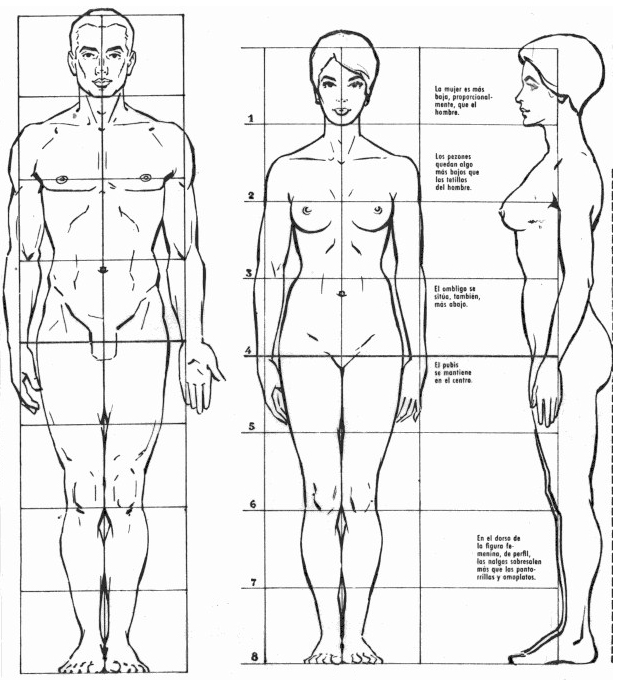

# (APPENDIX) Apendice {-}

# Proporción y canon {#intro}

En todas las áreas del conocimiento humano se suele utilizar las razones y las proporciones ya sea de manera explicita o implícita por ejemplo en los laboratorios químicos, la gastronomía, la agricultura, la construcción, la arquitectura entre otros; en especifico en el arte. En este capitulo las cantidades involucradas serán las longitudes aunque se pueden relacionar incluso con cantidades de colores, cantidades de texturas, cantidad de sombras entre otros aspectos asociados al arte plástico. La importancia de las proporciones, es debido al manejo de cantidades diversas, manteniendo la relación de dos cantidades.

## Razón

::: {.definition #razon name="Razón"}
Una razón es una fracción de la forma

$$
\frac{a}{b}(\#eq:fraccion)
$$
:::

donde $a$ y $b$ son números reales la fracción ***representa*** la relación que existe entre los números $a$ y $b$ es decir estas cantidades están asociadas.

En la ecuación \@ref(eq:fraccion) el resultado de dividir la fracción recibe el cociente, ademas $a$ y $b$ se denominan numerador y denominador respectivamente. Si $a>b$ la fracción recibe el nombre e *fracción propia* \index{fracción propia} y si $a<b$ la fracción recibe el nombre e *fracción impropia* \index{fracción impropia}

## Proporciones


::: {.definition #proporcion name="Proporcion"}
Una proporción es la igualdad de dos razones.

$$
\frac{a}{b}=\frac{c}{d}(\#eq:proporcion)
$$
:::


::: {.remark #rmk1 name="Observación"}
En una proporción sucede que si $a$ crece o decrece, $b$ crece o decrece multiplicada con la misma cantidad; en este caso recibe el nombre de proporción directa y si $a$ crece o decrece, $b$ decrece y crece en este caso recibe el nombre  proporción inversa. Generalmente en el arte plástico se utiliza las proporciones directas.
:::

:::{.example #wwwww name="Ejemplo"}
Las fracciones $\frac{a}{b}$ y $\frac{c}{d}$ no son necesariamente iguales, generalmente esto significa conservar las cantidades $a$ y $b$ de manera proporcional es decir $\frac{a}{b}=\frac{na}{nb}$ donde $n$ es cualquier número real.

:::


Las fracciones $\frac{a}{b}$ y $\frac{c}{d}$ no son necesariamente iguales, generalmente esto significa conservar las cantidades $a$ y $b$ de manera proporcional es decir $\frac{a}{b}=\frac{na}{nb}$ donde $n$ es cualquier número real.

Esta igualdad de fracciones (proporción) no ayuda a escalar (agrandar o reducir) cualquier figura 2d o 3d. Es decir si tenemos un modelo (linea poligonal izquierda en la Figura \@ref(fig:ww1)), cuyas dos longitudes son $a$ y $b$, además en la copia a realizar, (linea poligonal de la derecha en la Figura \@ref(fig:ww1)), establecemos la longitud $c$ como la copia trasformada de la longitud $a$ (un numero mayor a $a$ si deseamos aumentar el tamaño con respecto al original y de manera inversa si deseamos reducir el tamaño); la longitud $x$ es la incógnita que debe hallarse para mantener el tamaño de menera proporcional.

Si deseamos averiguar la longitud de $x$ de manera proporcional asociado al valor $c$ dado por conveniencia, primero se genera la razón $\frac{a}{b}$ asociado al modelo y la razón $\frac{c}{x}$ en la copia, en ese orden es decir $c$ y $a$ en el numerador pues $c$ es la trasformación de $a$ que se estableció

theorem	Theorem	thm
lemma	Lemma	lem
corollary	Corollary	cor
proposition	Proposition	prp
conjecture	Conjecture	cnj
definition	Definition	def
example	Example	exm
exercise	Exercise	exr
hypothesis	Hypothesis	hyp
$$
\frac{a}{b}=\frac{c}{x}\Longleftrightarrow ax=bc \Longleftrightarrow x=\frac{bc}{a}
$$

Sea $a=3$, $b=2$ y $c=5$ en la figura \@ref(fig:ww1) entonces$$
\frac{3}{2}=\frac{5}{x}\Longleftrightarrow 3x=2\cdot5 \Longleftrightarrow x=\frac{10}{3}=3.333
$$

```{r ww1, echo=FALSE, fig.align="center", fig.cap="Proporción"}
knitr::include_graphics('proporcion.svg')
```

Este proceso se puede iterar en una forma poligonal cuyo número de lados es mayor a dos, por ejemplo en la Figura \@ref(fig:ww), se tiene tres procesos adicionales estableciendo como punto partida al segmento $GF$ luego se traza dos semirectas cuyo extremos coinciden con los extremos del segmento $GF$, ademas es necesario conservar los ángulos de estos con respecto al segmento $GF$ es decir $\angle CBA=\angle FGK$ y $\angle DCB=\angle IFG$. Entonces construimos los segmentos de longitud $GK=GF\frac{AB}{BC}$ $FI=GF\frac{CD}{BC}$ deducidas a partir de las proporciones

$$
\frac{GK}{GF}=\frac{AB}{BC}\: \text{ y }\: \frac{FI}{GF}=\frac{CD}{BC}
$$los extremos $K$ e $I$ deben estar sobre las semirectas correspondientes, finalmente se proporciona el segmento $KH$ con el mismo procedimiento es decir ángulo $\angle BAE=\angle GKH$ y longitud $KH=KG\frac{EA}{BC}$

```{r ww, echo=FALSE, out.width='100%', out.height='100%', fig.align="center", fig.cap="Proporción de un polígono"}
if (knitr::is_html_output()) {
knitr::include_url("https://www.geogebra.org/classic/wdkjjtjp", height="700")} else {
knitr::include_graphics('proporcion.svg')
}
```

Todo figura de la realidad se pueden inscribrir en un polígono por tanto puede se predispone a la proporción. Por ejemplo considere la Figura \@ref(fig:ww) dada.

## Canon

Debido a la poligonalización de las figuras en general es posible establecer un modelo cuyas subdivisión conlleve a un modelo aplicable en futuras representaciones.

::: {.definition $canon name="Canon"}
Las proporciones perfectas o ideales del cuerpo humano y alude a las relaciones armónicas entre las distintas partes de una figura.
:::

```{r canonfig, echo=FALSE, out.width='100%', out.height='100%', fig.align="center", fig.cap="Proporción de un polígono"}

```


# Perspectiva cónica
[@xie2015]

## Raices de una ecuacion de segundo grado
## Propiedades de una ecuacion de segundo grado

# Ecacuaciones lineales de primer grado

## Soluciones de ecuacuiones lineales de primer grado
## Soluciones ...
## Forma matricial de una ecuación lineal
